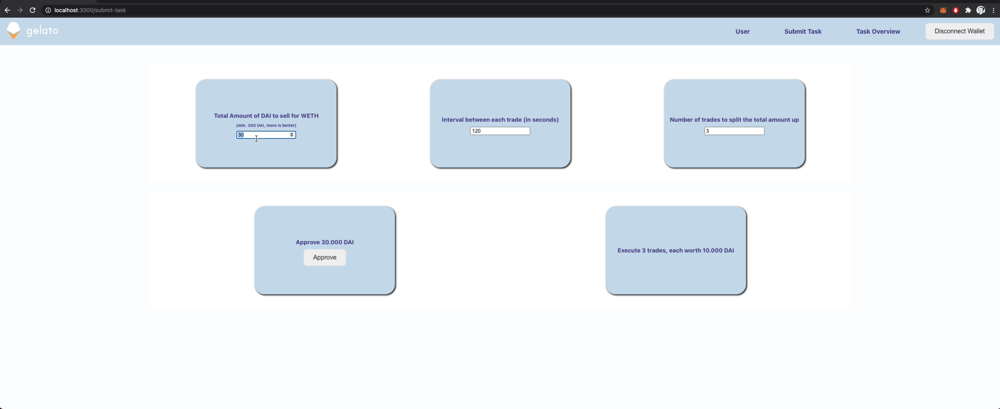

# Gelato Krystal - Dollar Cost Averaging - Monorepo
Monorepo containing:

- React App
- Hardhat package with SC tests & deployment files
- Contracts package containing addresses and ABIs

## Live UI
Submit DAI <> WETH Dollar Cost Averaging Orders on Mainnet:

https://gelato-krystal.vercel.app/

## Watch a quick video walkthrough of the UI
<a href="https://drive.google.com/file/d/162iUBphXUBZ2oBTIxDF5PTGxj52KBLNZ/view?usp=sharing" target="_blank">
     
</a>

## Mainnet Contract

**GelatoDCA:** [0x96A6877Ac1A2E560dF6e50b5bc69B2048F36b059](https://etherscan.io/address/0x96A6877Ac1A2E560dF6e50b5bc69B2048F36b059)

## Setup

Run
```
yarn
```

**Add alchemy id in packages/hardhat/.env**
```
ALCHEMY_ID=""
```

**Add Blocknative notify.js key in packages/react-app/.env**
```
REACT_APP_BLOCK_NATIVE=""
```

## Run the React App (MAINNET)

```
yarn react-app:start
```

## Test

## Run the Hardhat test suite

```
yarn hardhat:run-test
```